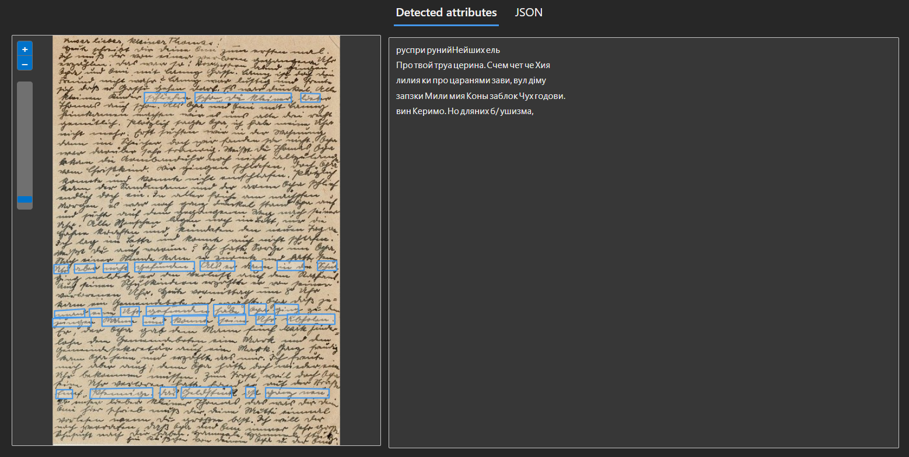
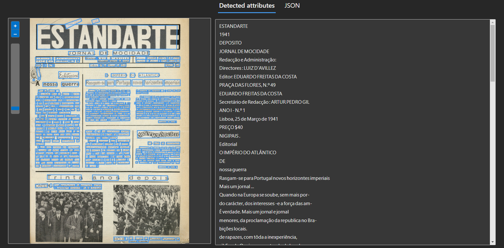
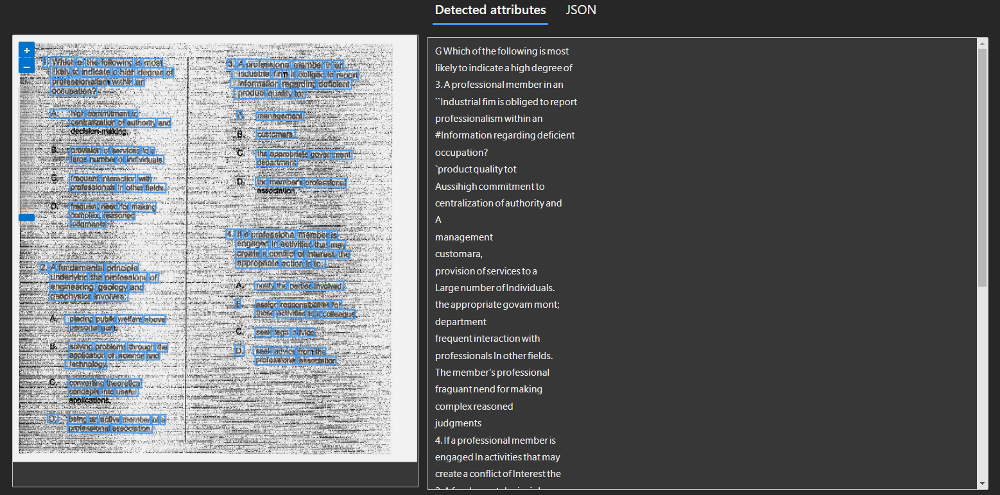
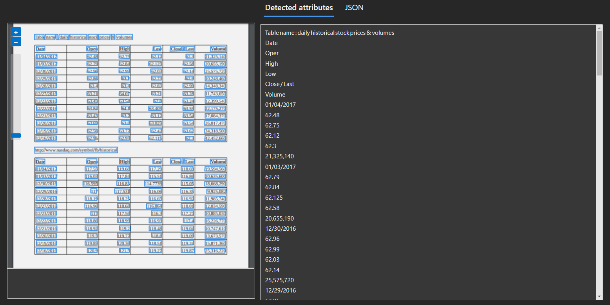

# dio-ai900-desafio2
> Testes com a ferramenta de OCR  do Azure AI Vision

### Considerações iniciais
A plataforma Azure AI Vision possui várias ferramentas de reconhecimento de imagens. Uma delas é a de OCR (optical character regognition, ou reconhecimento óptico de caracteres). Meu objetivo com os testes desse desafio foi testar os limites dessa ferramenta, as possibilidades que ela traz ao digitalizar documentos antigos e novos, e também alguns desafios dessa tarefa.

### Exemplo 1: carta antiga escrita à mão

A ferramenta não lidou bem com caligrafia antiga, reconhecendo poucas linhas e em alfabeto cirílico em vez de latino. 

Conclusão: é possível que modelos específicos para escrita à mão tenham melhores resultados.

### Exemplo 2: jornal antigo

Dessa vez, a ferramenta teve uma taxa de acerto bem maior, reconhecendo praticamente todo o texto. 

Conclusão: aliar OCR com um algoritmo de segmentação automática seria de grande ajuda para a tarefa de digitaliar documentos antigos, precisando apenas de revisão e correção de eventuais erros.

### Exemplo 3: _scan_ de baixa qualidade

A performance da ferramenta não foi tão boa quanto na imagem anterior, reconhecendo palavras erradas e pulando algumas. Além disso, os resultados em `output3.json` mostram que a confiança no reconhecimento das palavras foi bem inferior à do exemplo anterior.

Conclusão: garantir a qualidade das imagens a serem reconhecidas facilita o processo dos algoritmos de OCR e aumenta a confiança dos resultados.

### Exemplo 4: Planilhas impressas

O reconhecimento dos números parece ter funcionado bem, mas não há divisão clara de linhas ou colunas no resultado.

Conclusão: para digitalizar planilhas e tabelas, é necessário que haja uma etapa adicional de segmentação do texto.

### Conclusões
De modo geral, a ferramenta de OCR do Azure AI Vision parece ser consistente em seus resultados, tendo dificuldades semelhantes a outras ferramentas de OCR quanto à presença de ruídos e textos escritos à mão. Dificudades quanto à segmentação do texto podem ser contornadas com o uso de algoritmos adicionais. 

### Fonte das imagens
Links para as imagens utilizadas nos testes:
1. [Carta antiga escrita à mão](https://genealogizando.com.br/registros/9-dicas-para-decifrar-a-caligrafia-de-documentos-antigos/)
2. [Jornal antigo](https://pt.m.wikipedia.org/wiki/Ficheiro:Estandarte,_jornal_de_mocidade,_N.%C2%BA_1,_25_de_Mar%C3%A7o_de_1941,_capa.jpg)
3. [_Scan_ de baixa qualidade](https://graphicdesign.stackexchange.com/questions/61931/clean-up-the-background-for-scanned-document)
4. [Planilhas impressas](https://bytescout.com/blog/extracting-data-from-pdf.html)
